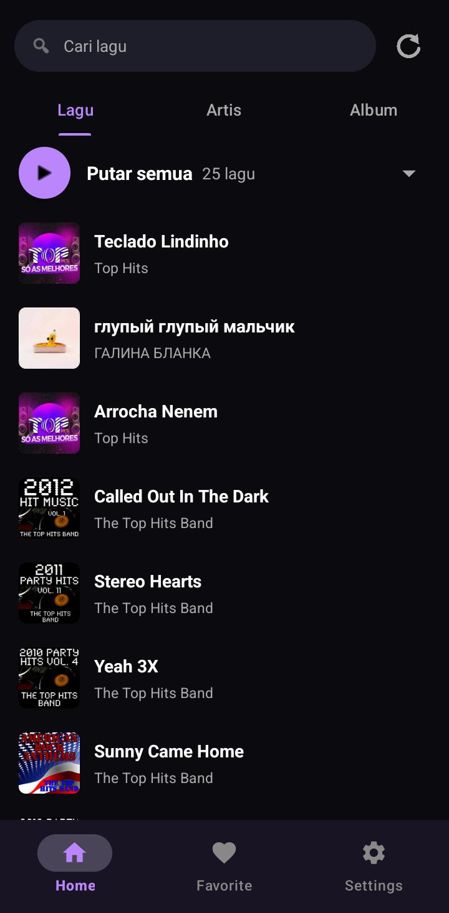
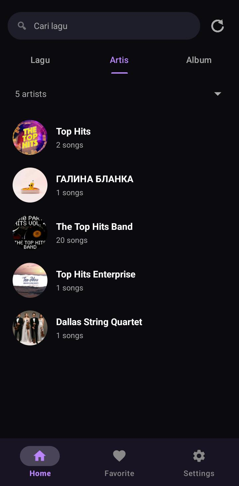
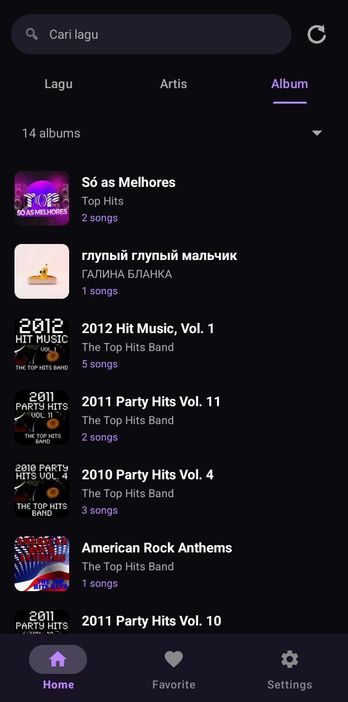
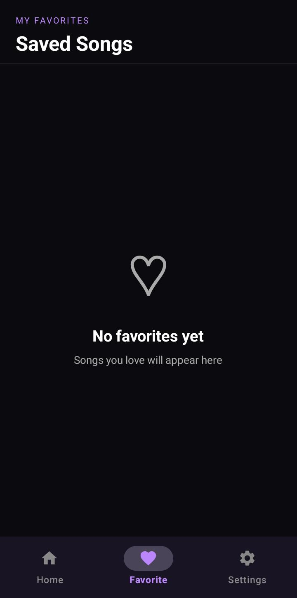
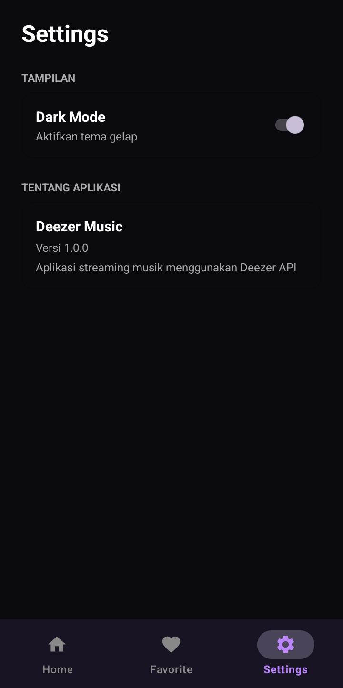

# 🎵 MyMusic

Aplikasi streaming musik Android yang memungkinkan pengguna mencari, memutar preview, dan menyimpan lagu favorit menggunakan Deezer API.


## Tampilan Aplikasi

| Lagu | Artis | Album |
|---|---|---|
|  |  |  |

| Detail | Favorit | Settings |
|---|---|---|
|  |  |  |


## Fitur

- Pencarian lagu berdasarkan judul
- Preview musik langsung di aplikasi
- Simpan lagu ke favorit
- Mode offline — menampilkan lagu yang tersimpan
- Tombol retry saat tidak ada koneksi internet
- Dark Mode dan Light Mode
- Tampilan modern dengan Material Design


## Spesifikasi Teknis

### Activity
- `SplashActivity` — Launcher utama aplikasi
- `MainActivity` — Activity utama dengan navigasi bawah
- `DetailActivity` — Halaman detail dan preview lagu

### Fragment
- `HomeFragment` — Pencarian dan daftar lagu
- `FavoriteFragment` — Daftar lagu favorit tersimpan
- `SettingsFragment` — Pengaturan tema aplikasi

### Teknologi yang Digunakan

| Teknologi | Kegunaan |
|---|---|
| Retrofit | Mengambil data dari Deezer API |
| SQLite | Menyimpan lagu favorit secara lokal |
| RecyclerView | Menampilkan daftar lagu |
| Navigation Component | Navigasi antar Fragment |
| Glide | Memuat gambar cover lagu |
| Executor dan Handler | Operasi background thread |
| SharedPreferences | Menyimpan pengaturan tema |
| Material Design | Komponen UI modern |

### API
- **Deezer API** — https://api.deezer.com
- Endpoint pencarian: `https://api.deezer.com/search?q={keyword}`


## Cara Penggunaan

1. **Buka aplikasi** — Splash screen muncul selama 3 detik
2. **Cari lagu** — Ketik nama lagu di kolom pencarian lalu tekan Search
3. **Putar preview** — Klik lagu untuk membuka halaman detail lalu tekan Play
4. **Simpan favorit** — Tekan ikon ❤️ untuk menyimpan lagu ke favorit
5. **Lihat favorit** — Buka tab Favorit untuk melihat semua lagu tersimpan
6. **Mode offline** — Lagu favorit tetap tampil meskipun tidak ada internet
7. **Ganti tema** — Buka tab Pengaturan untuk mengaktifkan Dark atau Light Mode


## 📂 Struktur Project
```
MyMusic/
├── activity/
│   ├── SplashActivity.java
│   ├── MainActivity.java
│   └── DetailActivity.java
├── adapter/
│   ├── AlbumAdapter.java
│   ├── ArtistAdapter.java
│   ├── FavoriteAdapter.java
│   └── SongAdapter.java
├── api/
│   ├── ApiClient.java
│   ├── ApiService.java
│   └── RetrofitInstance.java
├── database/
│   ├── AppDatabase.java
│   ├── SongDao.java
│   └── SongEntity.java
├── fragment/
│   ├── FavoriteFragment.java
│   ├── HomeFragment.java
│   └── SettingsFragment.java
├── listener/
│   ├── OnFavoriteClickListener.java
│   └── OnSongClickListener.java
├── model/
│   ├── Album.java
│   ├── AlbumItem.java
│   ├── Artist.java
│   ├── ArtistItem.java
│   ├── DeezerResponse.java
│   └── Song.java
├── player/
│   └── MusicPlayerManager.java
├── repository/
│   └── SongRepository.java
└── utils/
├── Constants.java
├── NetworkUtil.java
├── PreviewDownloadManager.java
├── SharedPrefManager.java
└── ThemeHelper.java
res/
├── layout/
│   ├── activity_detail.xml
│   ├── activity_main.xml
│   ├── activity_splash.xml
│   ├── fragment_favorite.xml
│   ├── fragment_home.xml
│   ├── fragment_settings.xml
│   ├── item_album.xml
│   ├── item_artist.xml
│   ├── item_favorite.xml
│   └── item_song.xml
├── menu/
│   ├── bottom_nav_menu.xml
│   └── toolbar_menu.xml
├── navigation/
│   └── nav_graph.xml
└── values/
├── themes.xml (light)
├── themes.xml (night)
├── colors.xml
├── dimens.xml
└── strings.xml
```


## ⚙️ Cara Install

### Cara 1 — Via APK (Mudah)

1. Buka halaman Releases di GitHub:
   `https://github.com/Mirnafebriasari/MyMusic/releases/tag/v1.0.0`
2. Klik file `app-debug.apk` → otomatis download
3. Pindahkan file APK ke HP Android
4. Aktifkan **Install from unknown sources** di HP:
   `Pengaturan → Keamanan → Install from unknown sources → ON`
5. Buka file `app-debug.apk` di HP → klik **Install**
6. Buka aplikasi **MyMusic**
   
### Cara 2 — Via Source Code (Build Sendiri)

#### Persyaratan
- Android Studio (versi terbaru)
- Java JDK 11 atau lebih tinggi
- Koneksi internet

#### Langkah-langkah

1. **Download source code** dari GitHub:
   - Klik tombol **Code → Download ZIP**
   - Extract file ZIP ke folder komputer kamu
   Atau lewat CMD: git clone https://github.com/Mirnafebriasari/MyMusic.git
2. **Buka project di Android Studio:**
   - Buka Android Studio
   - Klik **Open**
   - Pilih folder **MyMusic** hasil extract tadi
   - Tunggu Gradle sync selesai

3. **Jalankan aplikasi:**
   - Hubungkan HP Android ke komputer via USB
   - Aktifkan **Developer Mode** di HP:
     `Pengaturan → Tentang Ponsel → Ketuk Nomor Build 7x`
   - Aktifkan **USB Debugging:**
     `Pengaturan → Opsi Pengembang → USB Debugging → ON`
   - Klik tombol **Run** di Android Studio
   - Pilih HP kamu → klik **OK**
   - Aplikasi otomatis terinstall di HP
  
4. **Atau build APK sendiri:**
   - Build → Build Bundle(s)/APK(s) → Build APK(s)
   - File APK tersimpan di: app/build/outputs/apk/debug/app-debug.apk


## Developer

| | |
|---|---|
| **Nama** | Mirnafebriasari |
| **Tema** | Hobby — Music |
| **API** | Deezer API |
| **Tahun** | 2026 |


## Lisensi

Project ini dibuat untuk keperluan **Tugas Final Lab Mobile 2026**
